# Autonomous Driving in CARLA — VINS-Fusion SLAM + MPC + Traffic-Light Detection

A ROS 2 (Humble) stack that drives a CARLA ego vehicle autonomously by closing the loop over three
components:

1. **SLAM / state estimation** — a ROS 2 port of **VINS-Fusion** (stereo + IMU + GPS variants, with
   `global_fusion` for GPS), validated against CARLA ground truth.
2. **Control** — a **sampling Model-Predictive Controller (MPC)** that follows a reference trajectory
   using the estimated state.
3. **Perception** — a **traffic-light detector** (`src/tf_detect`) that turns the front camera into a
   stop / slow / go action.

> **Status.** SLAM is fully evaluated (online vs offline vs live, 4 variants × 5 runs × 3 scenes); the
> **MPC is tuned** (horizon & lookahead sweeps, §5.1); the **traffic-light** localization-vs-state
> behavior is characterized (§6.2); and the **full closed loop runs end-to-end** (§7) — stereo VINS →
> MPC → traffic-light gate, a 439 m lap at 0.81 m cross-track with brake-to-hold stops at red lights.

---

## Table of contents

1. [Problem statement](#1-problem-statement)
2. [Environment setup](#2-environment-setup)
3. [Ego vehicle](#3-ego-vehicle-kinematics-state-input-sensors)
4. [SLAM (VINS-Fusion): equations, config rationale, online/offline/live setup, results, analysis](#4-slam-vins-fusion)
5. [MPC: equations, method, & tuning experiment](#5-mpc-model-predictive-control)
6. [Traffic-light detection](#6-traffic-light-detection)
7. [Integration (SLAM + MPC + traffic light)](#7-integration)
8. [Conclusion & discussion](#8-conclusion--discussion)
9. [Commands](#9-commands)

---

## 1. Problem statement

**Goal: drive an ego vehicle in CARLA using SLAM-estimated state for MPC trajectory following, with
traffic-light-aware stopping.**

The vehicle must not rely on CARLA ground truth at run time. Instead it estimates its own pose from
on-board sensors (stereo cameras + IMU + GPS) via VINS-Fusion, feeds that estimate to an MPC that
tracks a reference path, and gates throttle/brake on a camera-based traffic-light state.

```
                       ┌─────────────────────────────────────────────┐
   CARLA (sync mode)   │  stereo 20 Hz · IMU 200 Hz · GNSS 10 Hz      │
   Tesla Model 3       └───────────────┬──────────────────┬──────────┘
                                       │                  │
                       ┌───────────────▼─────┐   ┌────────▼───────────┐
                       │  VINS-Fusion + GPS  │   │ traffic-light       │
                       │  (state estimation) │   │ detector (tf_detect)│
                       └───────────────┬─────┘   └────────┬───────────┘
                            state              stop/slow/go
                       {x, y, yaw, speed}             │
                                       │              │
                              ┌────────▼──────────────▼────────┐
                              │  sampling MPC (bicycle model)   │
                              └────────────────┬────────────────┘
                                  VehicleControl{throttle, steer, brake}
                                               │
                                       ┌───────▼────────┐
                                       │  CARLA ego     │
                                       └────────────────┘
```

---

## 2. Environment setup

| Component | Detail |
|-----------|--------|
| OS / middleware | Ubuntu, **ROS 2 Humble** |
| Simulator | **CARLA 0.9.x**, **synchronous mode**, fixed Δt = 0.005 s (**200 Hz** world tick) |
| Map | `Town10HD` (primary), `Town01` |
| Ego | `vehicle.tesla.model3` |
| Optimizer | **Ceres 2.2** (Manifold API) |
| Vision | **OpenCV 4.10 + CUDA** built in `~/local` (GPU *available*, but runs **CPU by default** — `use_gpu: 0`) |
| 3D mapping | apt **`rtabmap_ros`** (run under a clean `LD_LIBRARY_PATH` to avoid an ABI clash with `~/local`) |
| Packages | `vins_fusion_ros2`, `global_fusion`, `tf_detect` |

CUDA OpenCV must be on the library path at both link and run time:

```bash
cd ~/ros2_ws
source /opt/ros/humble/setup.bash
export LD_LIBRARY_PATH=/home/fibo3/local/lib:$LD_LIBRARY_PATH   # CUDA OpenCV 4.10
colcon build --packages-select vins_fusion_ros2 global_fusion --cmake-args -DCMAKE_BUILD_TYPE=Release
source install/setup.bash   # re-source after every build
```

---

## 3. Ego vehicle (kinematics, state, input, sensors)

### Sensors

| Sensor | Spec | Rate |
|--------|------|------|
| Stereo RGB cameras | 960 × 720, FOV 90°, `fx=fy=480`, `cx=480`, `cy=360`, **baseline 0.5 m** | **20 Hz** |
| IMU | 6-axis, mounted at CoG height (z = 1.5 m) | **200 Hz** |
| GNSS | WGS-84 lat/lon/alt (noise-free in sim) | **10 Hz** |
| World tick | synchronous, fixed Δt = 0.005 s | **200 Hz** |

Cameras are mounted at x = 1.5 m, z = 1.5 m; left at y = −0.25 m, right at y = +0.25 m (CARLA frame).

### Stereo calibration

VINS needs two calibrations: the per-camera **intrinsics** (how 3D rays map to pixels) and the
**stereo + camera↔body extrinsics** (where each camera sits relative to the IMU/body frame). Because
the rig lives in CARLA, both are *known exactly* — there is no calibration noise to estimate, so VINS
runs with `estimate_extrinsic: 0` (extrinsics fixed) and zero distortion.

**Intrinsics** — both cameras are the *same* ideal pinhole. CARLA renders a perfect pinhole from a
single FOV parameter, so there is **no lens distortion** and the two cameras share one model
([`cam_front_left.yaml`](config/carla/cam_front_left.yaml),
[`cam_front_right.yaml`](config/carla/cam_front_right.yaml)):

| Parameter | Value | Source |
|-----------|-------|--------|
| model | `PINHOLE` | CARLA ideal pinhole |
| resolution | 960 × 720 | sensor config |
| $f_x = f_y$ | 480.0 px | $f_x = \tfrac{W}{2\tan(\text{FOV}/2)} = \tfrac{960}{2\tan 45°} = 480$ |
| $(c_x, c_y)$ | (480.0, 360.0) | image center |
| $k_1, k_2, p_1, p_2$ | 0, 0, 0, 0 | no distortion (ideal pinhole) |

**Extrinsics** — the two `body_T_cam` homogeneous transforms in
[`carla_stereo.yaml`](config/carla/carla_stereo.yaml) place each camera in the body (IMU) frame. The
common rotation block maps the camera optical frame (x-right, y-down, z-forward) to the body frame
(x-forward, y-left, z-up); the translation is the camera position in body coordinates:

$$
{}^{b}T_{c_0} =
\begin{bmatrix} 0 & 0 & 1 & 1.5 \\ -1 & 0 & 0 & +0.25 \\ 0 & -1 & 0 & 0 \\ 0 & 0 & 0 & 1 \end{bmatrix}
\text{(left)}, \qquad
{}^{b}T_{c_1} =
\begin{bmatrix} 0 & 0 & 1 & 1.5 \\ -1 & 0 & 0 & -0.25 \\ 0 & -1 & 0 & 0 \\ 0 & 0 & 0 & 1 \end{bmatrix}
\text{(right)}
$$

Both cameras sit **1.5 m forward** of the body origin; the left is at $y = +0.25$ m and the right at
$y = -0.25$ m, for a **stereo baseline of 0.5 m**. (These body-frame $y$ signs are the CARLA values
$y = \mp0.25$ m negated by the CARLA→ROS convention of §[Frame convention](#frame-convention-carla--rosenu).)
This is the *winner rig* layout — cam0 = left at $y = +0.25$, cam1 = right at $y = -0.25$ — matched to
the reference VINS-Fusion-ROS2 configuration.

### Frame convention (CARLA → ROS/ENU)

CARLA is **left-handed (+y = right, yaw clockwise)**; ROS/ENU is right-handed (+y = left, yaw CCW).
The bridge (`carla_world.cpp`, `getEgoState`/`getEgoOdom`) converts by **negating $y$, yaw, $v_y$ and
$\omega_z$**:

$$
x_{\text{ros}} = x_{\text{carla}}, \qquad
y_{\text{ros}} = -y_{\text{carla}}, \qquad
\psi_{\text{ros}} = -\psi_{\text{carla}}, \qquad
v_{y,\text{ros}} = -v_{y,\text{carla}}, \qquad
\omega_{z,\text{ros}} = -\omega_{z,\text{carla}}
$$

> A left/right **camera swap** (a consequence of this +y = right convention) was the root cause of
> early live divergence; fixing it is what made live VINS match the offline result (see §4).

### Kinematic model & control

The MPC rolls out a **kinematic bicycle model** (wheelbase $L = 2.875\,\text{m}$, $dt = 0.10\,\text{s}$):

$$
\dot{x} = v\cos\psi, \qquad
\dot{y} = v\sin\psi, \qquad
\dot{\psi} = \frac{v}{L}\tan\delta, \qquad
\dot{v} = a
$$

- **State:** $(x, y, \psi, v)$ — position, heading, speed (ROS/ENU frame).
- **Input:** $(\delta,\, a)$ — steering and acceleration, mapped to a CARLA `VehicleControl`:
  $\text{throttle} \approx 0.10 + 0.20\,a + 0.04\,(\text{speed error})$ (clamped to $\le 0.45$),
  $\text{brake} = -a / a_{\text{dec}}$, $\text{steer} = -\delta$ (sign flip back into the CARLA frame).
  Max speed 8 m/s, max accel 2 m/s², max decel 4 m/s².

---

## 4. SLAM (VINS-Fusion)

### 4.1 Formulation — the equations

VINS-Fusion is a **tightly-coupled, optimization-based** estimator: pose estimation = minimizing a
sum of Mahalanobis residuals over a sliding window of recent keyframes (it is **not** a filter).

**Pipeline.** The **front end** tracks point features by KLT optical flow (`max_cnt: 150` features,
`min_dist: 30` px spacing, `flow_back: 1` = forward-backward consistency check). The **back end** runs
a sliding-window **bundle adjustment** over the most recent keyframes (10 in VINS-Fusion) with Ceres;
when a keyframe leaves the window it is **marginalized** into the prior $r_p$ so old information is
kept without unbounded growth. GPS, when enabled, is a **separate** pose-graph stage (`global_fusion`,
below). The state, cost, and residuals that follow describe that back-end optimization.

**State** — sliding window of $n{+}1$ keyframes and $m$ features. Each keyframe state $x_k$ holds
position, velocity, orientation, accelerometer bias and gyro bias; $x_c$ is the camera↔IMU extrinsic;
$\lambda_l$ is the inverse depth of feature $l$:

$$
\mathcal{X} = [\,x_0,\, x_1,\, \dots,\, x_n,\; x_c,\; \lambda_0,\, \dots,\, \lambda_m\,], \qquad
x_k = [\,p^w_{b_k},\; v^w_{b_k},\; q^w_{b_k},\; b_a,\; b_g\,], \qquad
x_c = [\,p^b_c,\; q^b_c\,]
$$

**Cost** — maximum-a-posteriori over three residual groups: a marginalization prior (from the
dropped-out keyframe), the IMU preintegration terms, and the visual reprojection terms:

$$
\min_{\mathcal{X}} \, \{\, \| r_p - H_p\,\mathcal{X} \|^{2} + \sum_{k \in \mathcal{B}} \| r_{\mathcal{B}}(\hat{z}_{b_k b_{k+1}},\, \mathcal{X}) \|_{P_{\mathcal{B}}}^{2} + \sum_{(l,j) \in \mathcal{C}} \| r_{\mathcal{C}}(\hat{z}_{l}^{c_j},\, \mathcal{X}) \|_{P_{\mathcal{C}}}^{2} \,\}
$$

**IMU preintegration residual** $r_{\mathcal{B}}$ couples two keyframes through the preintegrated
$\hat{\alpha},\hat{\beta},\hat{\gamma}$ ($g^w$ = gravity). This is the block that fails on CARLA
(see §4.6):

$$
r_{\mathcal{B}} =
\begin{bmatrix}
R^{b_k}_w\big(p^w_{b_{k+1}} - p^w_{b_k} - v^w_{b_k}\Delta t + \tfrac{1}{2}g^w \Delta t^2\big) - \hat{\alpha} \\[2pt]
R^{b_k}_w\big(v^w_{b_{k+1}} - v^w_{b_k} + g^w \Delta t\big) - \hat{\beta} \\[2pt]
2\left[\, \hat{\gamma}^{-1} \otimes (q^w_{b_k})^{-1} \otimes q^w_{b_{k+1}} \,\right]_{xyz} \\[2pt]
b_{a,k+1} - b_{a,k} \\[2pt]
b_{g,k+1} - b_{g,k}
\end{bmatrix}
$$

**Visual reprojection residual** $r_{\mathcal{C}}$ — feature $l$ first seen in frame $i$, re-observed
in frame $j$: back-project with its inverse depth $\lambda_l$, transport $i \to j$ through the poses,
and compare to the measured pixel $u^{c_j}_l$ ($\pi(\cdot)$ = projection):

$$
r_{\mathcal{C}} = u^{c_j}_l \;-\; \pi\!\left( T^c_b\, T^{b_j}_w\, T^w_{b_i}\, T^b_c\; \tfrac{1}{\lambda_l}\,u^{c_i}_l \right)
$$

**GPS fusion (`global_fusion`)** is a *second*, looser stage: a pose graph (Ceres,
[`global_fusion/src/Factors.h`](../global_fusion/src/Factors.h)) that fuses the VIO trajectory with
global GPS fixes. It has two factor types — a 3-D absolute GPS-position factor (`TError`) and a 6-D
VIO relative-pose factor (`RelativeRTError`):

$$
r_T = \frac{t_j - t_{\text{gps}}}{\sigma_{\text{gps}}}, \qquad
r_t = \frac{R(q_i)^{-1}\,(t_j - t_i) - \hat{t}_{ij}}{\sigma_t}, \qquad
r_q = \frac{2\left[\, \hat{q}_{ij}^{-1} \otimes (q_i^{-1} \otimes q_j) \,\right]_{xyz}}{\sigma_q}
$$

The GPS factor anchors **absolute** position (kills long-term drift); the relative factor preserves
the locally-smooth VIO **shape**. This is exactly why the GPS variants stay bounded where pure VO/VIO
drift away.

### 4.2 Configuration — the four config layers

The SLAM stack is configured in **four layers**, one per pipeline stage. Each adds to the one before:

| Layer | What it configures | Where | Used by variants |
|-------|--------------------|-------|------------------|
| **(a) VO** | stereo visual odometry (intrinsics, extrinsics, solver) | [`carla_stereo.yaml`](config/carla/carla_stereo.yaml) | `stereo`, `stereo+gps` |
| **(b) VINS** | VO **+ IMU** (visual-inertial) | [`carla_stereo_imu.yaml`](config/carla/carla_stereo_imu.yaml) | `stereo+imu`, `stereo+imu+gps` |
| **(c) global_fusion** | GPS pose-graph stage on top of VO/VINS | ROS args + `Factors.h` (sibling pkg) | `*+gps` |
| **(d) RTAB** | live 3D mapping + loop closure | launch args in [`carla_native_multi.launch.py`](launch/carla_native_multi.launch.py) | live only |

Every non-default value is justified by a *property of the CARLA rig*, not guesswork.

**(a) VO config** ([`carla_stereo.yaml`](config/carla/carla_stereo.yaml), `imu: 0`) — the base layer.
Below is what changed from the stock VINS-Fusion (EuRoC) template and **why CARLA makes it correct**:

| Parameter | Stock (EuRoC) | Ours (CARLA) | Reason — what we know about the CARLA rig |
|-----------|---------------|--------------|-------------------------------------------|
| camera model | MEI/fisheye, nonzero $k_1,k_2,p_1,p_2$ | `PINHOLE`, distortion all 0 | CARLA's `sensor.camera.rgb` renders an **ideal pinhole** — no lens distortion to model |
| $f_x,f_y,c_x,c_y$ | from calibration | $f{=}480$, $(c_x,c_y){=}(480,360)$ | intrinsics are **exact**: $f = W/2\tan(\text{FOV}/2) = 960/2\tan 45° = 480$; principal point = image center |
| `body_T_cam0/1` | measured drone extrinsics | exact rig (fwd 1.5, $y{=}\pm0.25$, baseline 0.5 m) | we *place* the cameras, so the extrinsic is **known to machine precision** — no tape-measure error |
| `estimate_extrinsic` | 0 | 0 | extrinsics are exact, so nothing to refine — VINS trusts them and spends its DOF elsewhere |
| `max_num_iterations` | 8 | 100 | EuRoC's 8 is a **real-time** cap; most evaluation is **offline** (`vins_bag_reader`), so let Ceres fully converge for the accuracy ceiling |
| `max_solver_time` | 0.04 | 0.08 | headroom for the heavier solve (still keeps up live) |
| `keyframe_parallax` | 10.0 | 5.0 | CARLA streets are wide and feature-sparse; lower parallax keeps **more keyframes** so the window isn't starved |
| `image_skip` | (default 2) | 1 | process **every** frame — skip-2 created a frame-skip race that broke run-to-run determinism |

> Calibration is the hardest, noisiest part of a real VINS setup; in CARLA the geometry is *given*, so
> we hand VINS the exact model and `estimate_*: 0` tells it **not** to waste DOF re-estimating it.
> (Mounting detail: cam0 = left at $y{=}{+}0.25$, cam1 = right at $y{=}{-}0.25$; flipping this L/R
> assignment is the [camera-swap bug](#frame-convention-carla--rosenu) that broke live VINS.)

**(b) VINS config** ([`carla_stereo_imu.yaml`](config/carla/carla_stereo_imu.yaml), `imu: 1`) — VO
**plus the IMU**. Calibration, solver, and feature-tracker blocks are *identical* to the VO config;
only the IMU is added:

| Parameter | Value | Reason |
|-----------|-------|--------|
| `imu` | `0` → `1` | the one switch that turns VO into visual-**inertial** odometry |
| `imu_topic` | `/carla/ego_vehicle/imu` | the sim IMU stream (200 Hz) |
| `acc_n,gyr_n` | 0.00147 / 0.000244 | sim IMU is **noise-free**; tiny BNO055-datasheet floors instead of EuRoC's real-MEMS noise |
| `acc_w,gyr_w` | 0.0005 / 0.00002 | minimal bias random-walk for a clean sim IMU |
| `g_norm` | 9.81007 | CARLA's gravity magnitude |
| `estimate_td` / `td` | 0 / 0 | **synchronous** sim: camera & IMU are stamped off the *same* tick, so the cam–IMU offset is exactly 0 — estimating it would only inject noise |

> **Honest caveat.** These tight IMU values correctly describe a noise-free sim IMU, but they do **not**
> rescue stereo+IMU on smooth driving — that is an *observability* degeneracy (§4.6), not a noise-model
> error, and no `acc_n`/`gyr_n` setting fixes it. (The VO config also carries these values, unused, for
> file parity.)

**(c) global_fusion config** — the GPS pose-graph stage is a **separate package** (`global_fusion`)
with **no YAML in this repo**. It is configured entirely by ROS arguments at launch — the VIO input,
the GPS topic, and the fused output (see §[Commands](#9-commands)):

```bash
ros2 run global_fusion global_fusion_node --ros-args -p use_sim_time:=true \
  -r /vins_estimator/odometry:=/vins_stereo/odometry \   # which VO/VINS variant to anchor
  -r /gps:=/carla/ego_vehicle/gnss \                      # CARLA GNSS (noise-free)
  -r global_odometry:=/vins_stereo_gps/odometry
```

The fusion **weights** (the $\sigma_{\text{gps}}, \sigma_t, \sigma_q$ of §4.1) are not exposed as
parameters — they are the factor covariances hardcoded in `global_fusion/src/Factors.h`. Because
CARLA's GNSS is noise-free, the GPS factor is trusted heavily, which is why the `*+gps` variants stay
sub-metre and bounded.

**(d) RTAB config** — live 3D mapping (apt `rtabmap_ros`) is configured by the `rtab_params` list and
launch arguments in [`carla_native_multi.launch.py`](launch/carla_native_multi.launch.py), and runs
under a **clean `LD_LIBRARY_PATH`** (`RTAB_CLEAN_LD`) to avoid an ABI clash with the `~/local` CUDA
OpenCV. Key settings:

| Setting | Value | Reason |
|---------|-------|--------|
| `frame_id` / `odom_frame_id` | `body` / `world` | match the VINS odom tree (world→body), bridged onto `/tf` by `odom_to_tf.py` |
| `visual_odometry` | `false` | RTAB does **not** compute its own odom — it consumes the VINS odom (`rtab_odom`) |
| `stereo` | `true` | fed the live stereo pair + `camera_info` |
| `Rtabmap/LoopGPS` | `true` | use GNSS to assist loop-closure detection |
| `Optimizer/Robust` | `true` | robust graph optimization for loop closures |
| `Reg/Force3DoF` | `false` | full 6-DOF (the car pitches/rolls slightly on CARLA terrain) |
| `Vis/MinInliers` | `20` | min inliers to accept a loop closure |
| `Kp/MaxFeatures` / `Vis/MaxDepth` | `250` / `20.0 m` | feature budget and stereo depth cutoff |
| `Stereo/MinDisparity` | `2.0` | reject far/near-infinite-depth matches (recall depth $\propto 1/d$) |

RTAB's loop-closure correction is applied back onto the VINS odom and republished as
`/rtabmap/corrected_odom` (usable as the MPC state).

### 4.3 Experiment setup

Four estimator variants, each run **5 times** per scene, across **three data paths** (§4.4):

| Variant | Sensors | Pipeline |
|---------|---------|----------|
| `stereo` | stereo cameras only | VINS visual odometry |
| `stereo+imu` | stereo + IMU | VINS visual-inertial odometry |
| `stereo+gps` | stereo + GPS | VINS VO → `global_fusion` pose graph |
| `stereo+imu+gps` | stereo + IMU + GPS | VINS VIO → `global_fusion` pose graph |

Ground truth = CARLA `/carla/ego_vehicle/odometry`. Metrics = **APE RMSE** (Umeyama-aligned absolute
trajectory error) and **5-run spread** (run-to-run determinism); `DIV` = diverged (> 10⁴ m).

**The three scenes** (each a CARLA-autopilot drive, recorded once then replayed/observed through all
three paths):

| Scene | Map | Source bag | Duration | Route | Character |
|-------|-----|------------|:--------:|-------|-----------|
| `town01_normal` | Town01 | `town01_drivenormal` | 39.5 s | ~190 m segment, ~5 m/s | easy, well-conditioned baseline |
| `town10_normal` | Town10HD | `noimunoise` | 114.7 s | **~442 m loop**, ~5.4 m/s | normal-speed urban loop — **smooth** (the degenerate motion) |
| `town10_alwaysrun` | Town10HD | `alwaysdrive` | 110.4 s | ~442 m loop, continuous | **never stops** — varied accel/braking/turning |

The town10 loop is ~442 m (measured from GT). The only difference between the two town10 scenes is the
**motion profile** — `alwaysrun` keeps the car continuously maneuvering, which is exactly what makes
the IMU observable there but not on the smooth `normal` drive (§4.6). For the **live** town10 runs the
car is driven on GT around the same loop (~82 s, mean 5.4 m/s) while the four VINS variants observe
passively.

> **Initialization note.** VINS-Fusion needs a **moving** start: visual-inertial init must observe
> scale and biases from parallax + IMU excitation, so a *stationary* start initializes, immediately
> NaNs, and re-initializes in a loop (observed 54× on a still-start bag). Every dataset here starts in
> motion — the always-moving bags give a clean 1 init, 0 re-inits.

### 4.4 Online vs offline vs live — setup, data flow, timeflow

The **same VINS code** runs in all three. What differs is *how* the stereo/IMU/GPS streams reach it
and *which clock* drives time — and that alone changes determinism, speed, and what the result means.

|  | **online** | **offline** | **live** |
|--|-----------|------------|----------|
| Data source | recorded rosbag | recorded rosbag | live CARLA server |
| Clock (time base) | wall-clock × rate, via `/clock` | message `header.stamp` | CARLA sim tick |
| Delivery | async DDS pub/sub (**lossy**) | synchronous, in-order (**lossless**) | synchronous sensor callbacks |
| Speed | real-time (1×) | **~10× faster** | real-time |
| Determinism | **no** (timing-dependent) | **yes**, config-dependent (bit-identical single-thread; ~0.3 m multi-thread) | yes (after camera-swap + rate fix) |
| What it means | what you'd get live | best-case accuracy ceiling | the real closed-loop system |

The two **replay** paths (online vs offline) feed the *same recorded data* to the *same VINS* — the only
difference is delivery. Online streams over DDS and **drops frames** when the estimator lags (lossy,
non-deterministic); offline hands **every** message straight in, in `header.stamp` order (lossless,
deterministic, ~10×). That single difference is the whole story:

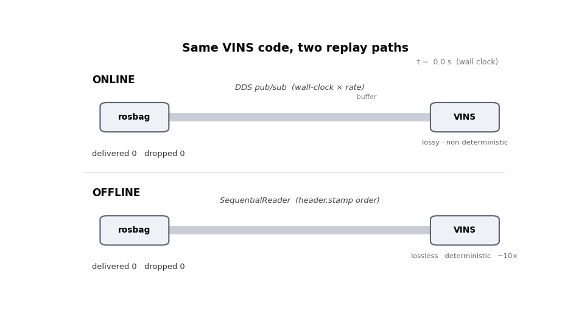

> Regenerate with [`python figures/make_dataflow_gif.py`](figures/make_dataflow_gif.py).

**Online** — `ros2 bag play` republishes topics at wall-clock × rate; VINS subscribes over DDS. If
the estimator can't keep up, frames are **dropped**, and which ones drop varies run-to-run → the
non-determinism seen in §4.5.

```
 rosbag ──ros2 bag play --clock -r 1.0──▶ /clock  (time = wall-clock × rate)
                                        ├▶ /cam_front_left, /cam_front_right ┐
                                        ├▶ /imu                              ├─DDS pub/sub─▶ VINS node ─▶ /…/odometry
                                        └▶ /gnss                             ┘   ▲
                                                                  if VINS lags, frames DROP here (lossy)
```

**Offline** — `vins_bag_reader` opens the bag with `rosbag2_cpp::SequentialReader` and feeds **every**
message straight into VINS in `header.stamp` order. Nothing is dropped, time comes from the stamps,
and with single-thread + seeded RANSAC the result is **bit-identical** every run (multi-threaded it is
*near*-deterministic, ~0.3 m); either way ~10× faster than playback.

```
 rosbag ──SequentialReader (direct read)──▶ messages in header.stamp order
                                            └─ hand EACH frame directly into VINS ─▶ CSV
   time = header.stamp · no DDS · no drops · seeded RANSAC ⇒ reproducible (bit-identical single-thread), ~10× real-time
```

**Live** — the native CARLA C++ node runs the simulator in **synchronous mode**: each `tick()`
advances sim time by Δt and produces the due sensor frames in-process; VINS estimates the state, the
MPC turns it into a `VehicleControl`, that is applied, and the **next** tick is requested. The
estimate is in the control loop — the only path where SLAM error actually affects where the car goes.

```
 CARLA server (sync, 200 Hz tick)
   tick() ─▶ stereo@20Hz · IMU@200Hz · GNSS@10Hz ─in-process─▶ VINS ─▶ state {x,y,yaw,v}
                                                                         │
                          VehicleControl{throttle,steer,brake} ◀─ MPC ◀─┘
                                          │
                                          └──▶ apply, then request next tick()   (closed loop)
   time = sim clock · estimate feeds control feeds the next sensor frame
```

Unlike the two open-loop replay paths above, live is a **closed loop**: the synchronous world advances
one `tick()` at a time, VINS-Fusion estimates the state, the sampling MPC turns it into a
`VehicleControl`, that control is applied, and only **then** is the world ticked on — so the estimate
literally steers the car and SLAM error feeds back into the next sensor frame.

The two rates matter for understanding the implementation: the **world ticks at 200 Hz** (Δt = 0.005 s,
one IMU sample per tick), but the **camera fires only every 10th tick** (20 Hz). VINS produces a new
state per camera frame and the MPC runs per control cycle, so **one full loop of the diagram = one
20 Hz control cycle = 10 world ticks = 0.05 s** (10 IMU samples + 1 stereo frame). That is why the GIF's
`tick` counter advances by 10 each lap while a single `frame` completes.

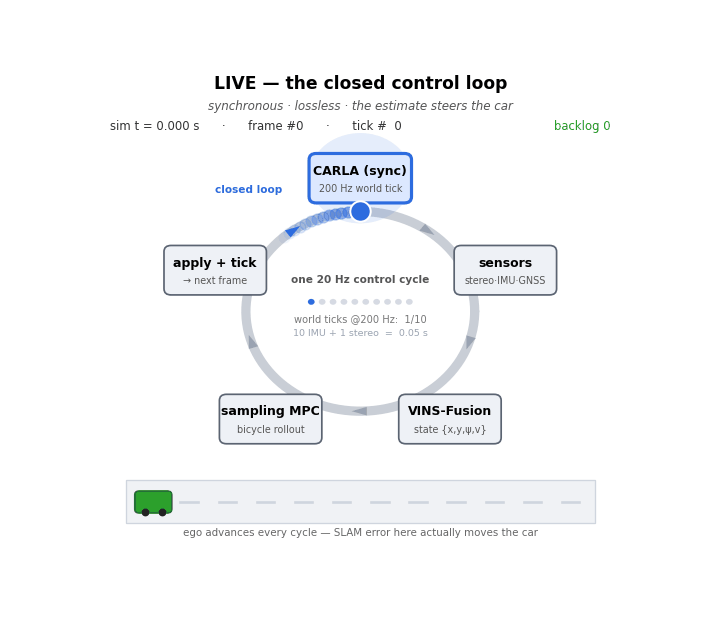

> Regenerate with [`python figures/make_livemode_gif.py`](figures/make_livemode_gif.py).

**Stereo-only (no IMU).** The same closed loop *without* the IMU is simpler and **single-rate**: there
is no 200 Hz inner loop, so VINS updates **once per 20 Hz stereo frame**, and metric scale comes from
the **0.5 m baseline** via triangulation ($\text{depth} = f\,B / \text{disparity}$) rather than the IMU.
This is the **most repeatable** variant (bit-identical run-to-run) and, on smooth CARLA driving, it
sidesteps the IMU observability degeneracy that sinks the stereo+IMU variants (§4.6).

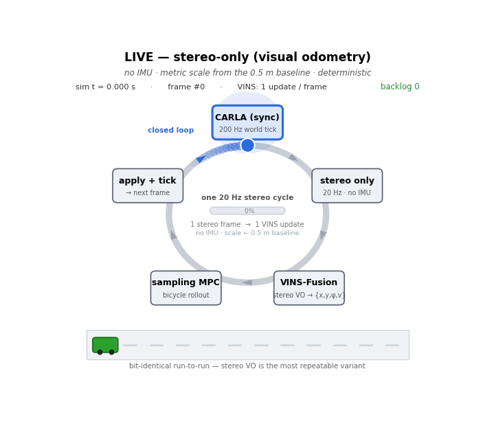

> Regenerate with [`python figures/make_livemode_stereo_gif.py`](figures/make_livemode_stereo_gif.py).

**Timeflow takeaway.** Online and offline **replay the same recorded data**, so offline is the
*accuracy ceiling* (lossless + deterministic) and online is *what you'd actually get live* under
timing jitter. Live is the real system, where the estimate also steers — so a divergence there (the
IMU variants) is conclusive about the SLAM, not an artifact of dropped frames or control.

### 4.5 Results

**`town01_normal`** — easy baseline (APE RMSE [m] / 5-run spread [m]):

| Variant | online | offline |
|---------|:------:|:------:|
| stereo | 20.6 / 0.000 | **0.48 / 0.42** |
| stereo+imu | 22.8 / 7.2 | **11.0 / 7.95** |
| stereo+gps | 10.8 / 17.1 | **0.25 / 0.02** |
| **stereo+imu+gps** | 1.5 / 2.6 | **0.20 / 0.00** |

**`town10_normal`** — normal-speed loop (APE RMSE [m] / 5-run spread [m]; live = RMSE only †):

| Variant | online | offline | live |
|---------|:------:|:------:|:----:|
| stereo | 45.4 / 0.00 | **6.4 / 0.20** | **0.6** |
| stereo+imu | 1255 / 0.02 | **1161 / 1406** | **DIV** |
| stereo+gps | 2.2 / 1.38 | **0.26 / 0.01** | **0.3** |
| stereo+imu+gps | 136 / 651 | **20.7 / 34.5** | **DIV** |

Online = `output_rosbag/town10_normal`, offline = `output_direct_xyyaw/town10_normal` (RMSE and spread
both recomputed from these so each cell is one consistent source); live = `logs/run{1..5}.csv`.

† **Live spread is omitted** because the 5 live runs are *independent drives* (each with its own GT),
so a same-input determinism spread isn't defined; live run-to-run consistency is covered in the live
figures/caption below. Online/offline replay the *same* bag, so their spread **is** a true determinism
measure: offline is near-deterministic (~0.01–0.2 m for bounded variants); the large spreads are the
diverged IMU variants (divergence amplifies tiny differences). Online stereo is also deterministic
(0.00) — its high RMSE is timing-induced frame loss, not non-determinism.

**`town10_alwaysrun`** — continuous, varied motion (APE RMSE [m] / spread [m]):

| Variant | online | offline |
|---------|:------:|:------:|
| stereo | DIV / — | **12.8 / 0.33** |
| stereo+imu | 920 / 3.3 | **5.0 / 2.36** |
| stereo+gps | DIV / — | **0.35 / 0.00** |
| **stereo+imu+gps** | 171.9 / 593 | **0.25 / 0.00** |

> **Caveats on the tables.** (1) The **offline** columns are the **latest re-collection** (current
> config, with orientation logged — see the yaw table below); the **online** columns are older and
> read worse, so online-vs-offline is **not** strictly like-for-like (especially the town10 online
> columns, still pre-winner config). (2) **Determinism:** this offline collection is **not**
> bit-identical (spreads ~0.2–0.4 m for bounded variants, not 0.000) — it was run with
> `multiple_thread: 1`; the earlier bit-identical result used single-thread + seeded RANSAC.

**Direct-mode heading error** (yaw RMSE, deg; frame-independent — best constant yaw offset removed,
the rotational analog of the Umeyama position alignment). Now available because the offline writer
logs the quaternion (§[Commands](#9-commands)):

| Variant | town01_normal | town10_normal | town10_alwaysrun |
|---------|:-------------:|:-------------:|:----------------:|
| stereo | **0.2°** | **1.9°** | 6.5° |
| stereo+imu | 4.1° | 67.7° † | 2.6° |
| stereo+gps | **0.6°** | **94.3°** ‡ | **77.2°** ‡ |
| stereo+imu+gps | 4.6° | 71.6° | 34.9° ‡ |

† diverged in position (~1160 m), so heading is meaningless too.
‡ **`global_fusion` heading is unreliable on the town10 loop**: GPS pins *position* (sub-metre) but
heading is only weakly observable from position alone, so the GPS variants show sub-metre position
with **erratic orientation** on town10 (yaw sweeps ~630° vs GT's 360°) — while on the town01 route the
same pipeline is fine (0.6°). A real loosely-coupled-fusion property, not a metric artifact.

Aligned **x, y, and heading-error vs GT over time** (run1; flat = perfect). On town10_normal,
`stereo+gps` (green) sits on GT in x/y yet its yaw error swings to ±150° — the finding above made
visual; town01 stays flat in all three:

| town01_normal | town10_normal | town10_alwaysrun |
|---|---|---|
| 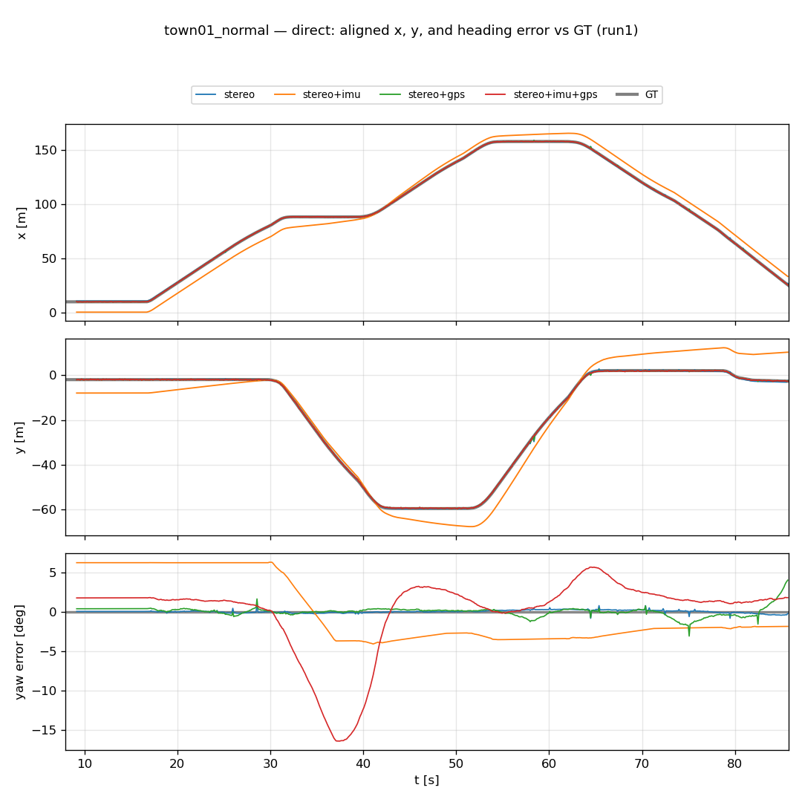 | 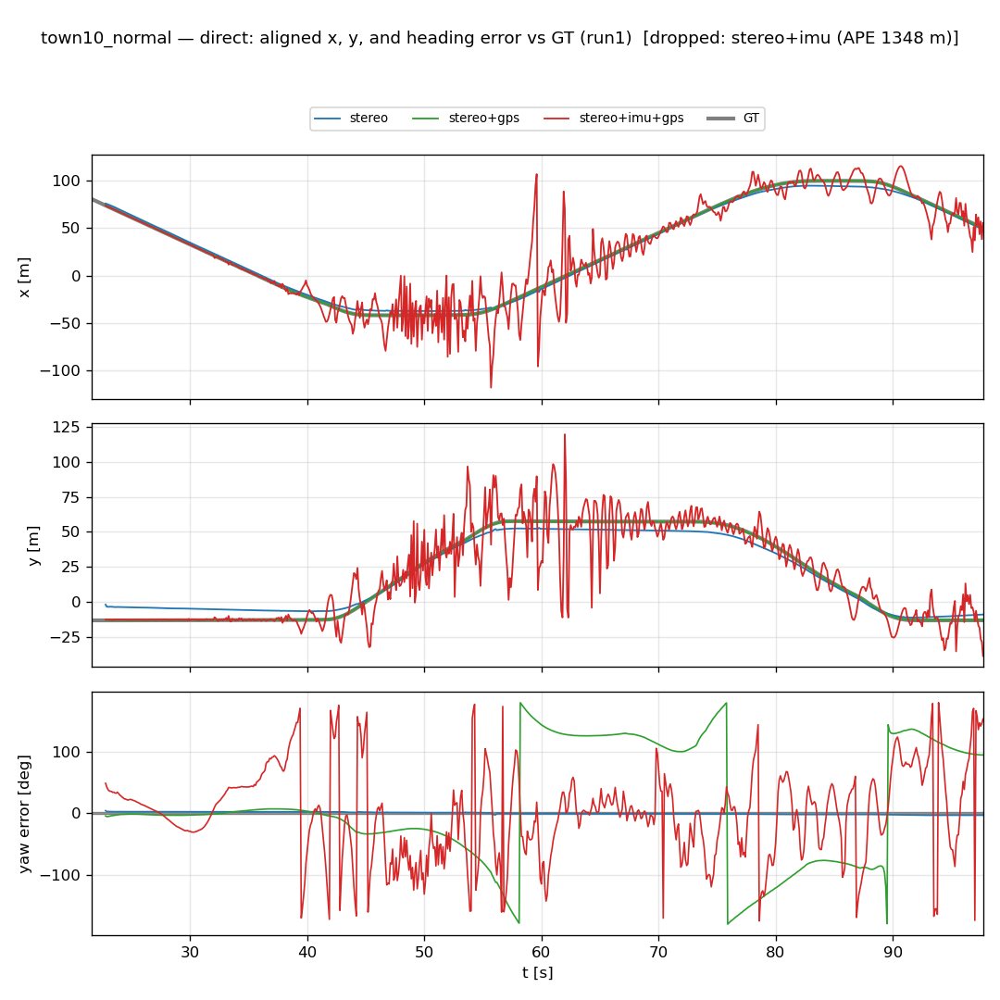 | 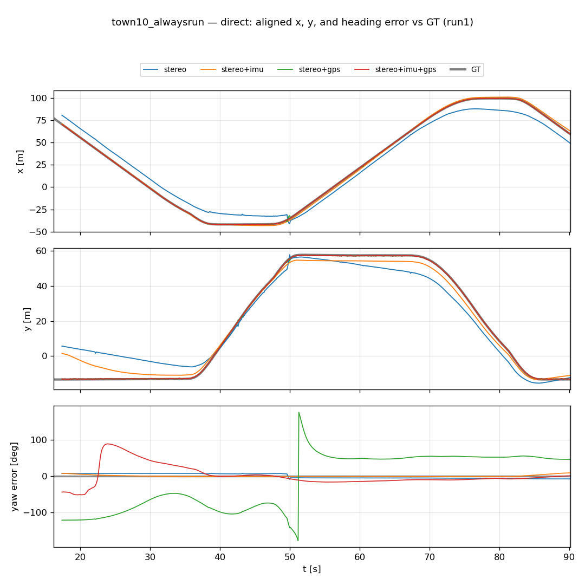 |

| Live tracking (town10_normal) | Divergence onset (town10_normal) |
|---|---|
| 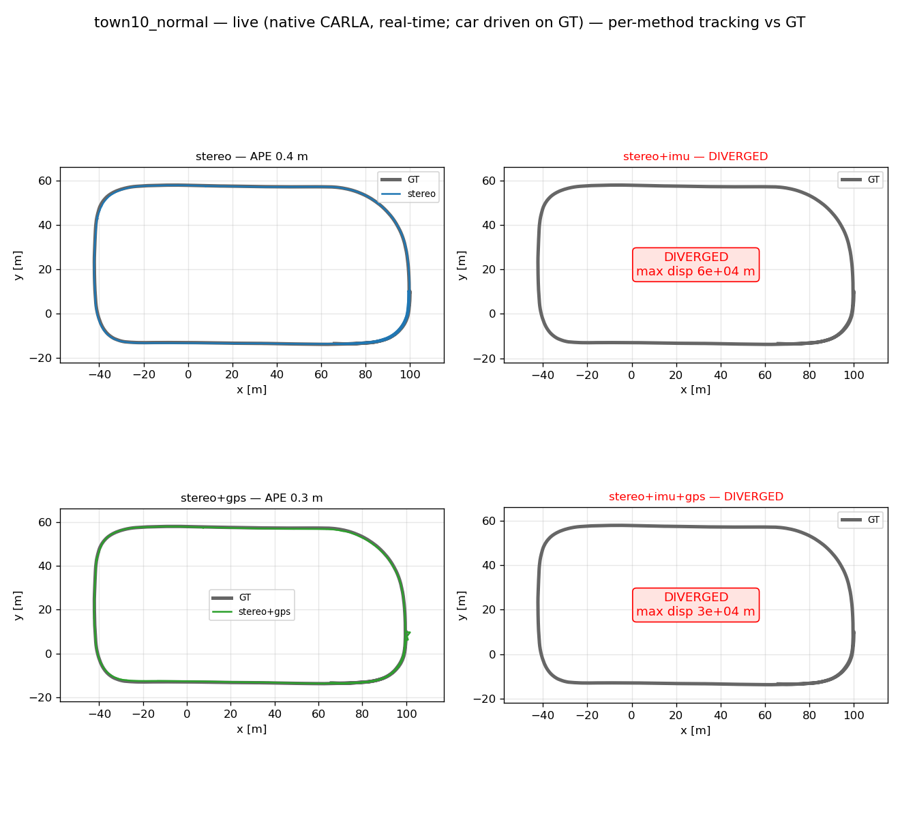 | 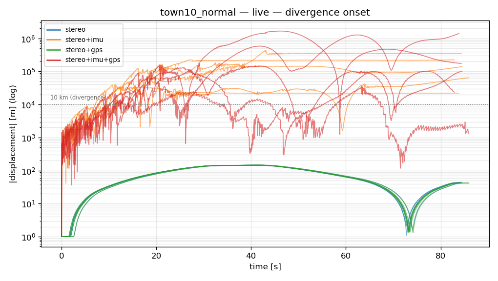 |

| Offline track — town01 (all bounded) | Offline track — town10_alwaysrun (all four bounded) |
|---|---|
| 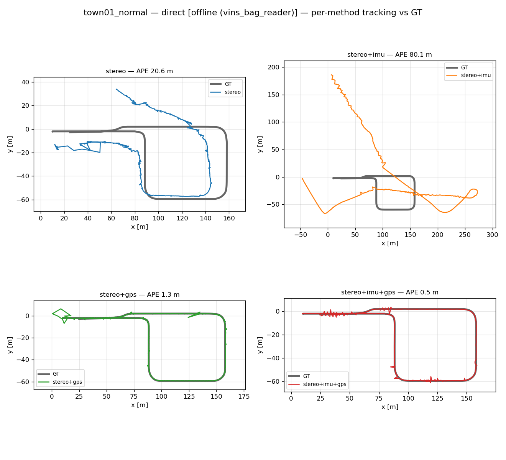 | 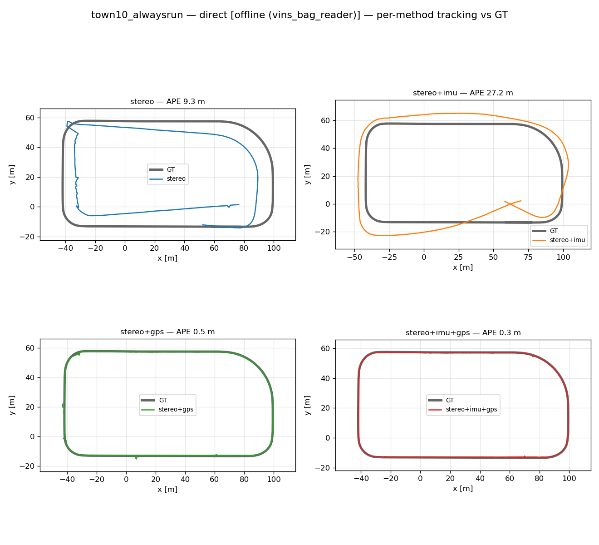 |

### 4.6 Analysis — key findings

1. **GPS is the single biggest accuracy win.** On every normal-speed scene the GPS variants are the
   most accurate (sub-metre offline/live), and they stay bounded where pure VO/VIO diverges.
2. **Pure stereo is the most *repeatable*** (smallest run-to-run spread) but **never the most
   accurate**, and it can diverge on low-excitation motion. (Determinism is **config-dependent**: with
   single-thread + seeded RANSAC the offline runs were bit-identical; the latest `multiple_thread: 1`
   collection is *near*-deterministic — ~0.2–0.4 m spread — not bit-identical.)
3. **The IMU paths diverge on smooth, normal driving** — and this is a **fundamental visual-inertial
   observability degeneracy**, not a tuning bug. CARLA's smooth, planar, low-rotation motion leaves
   the IMU-coupled states (velocity, accel/gyro bias, gravity) unobservable. This is corroborated
   cross-dataset: VINS-Fusion's stereo+IMU **works** on EuRoC (rich drone rotation) and KITTI, but
   **diverges** on CARLA stereo+IMU while CARLA stereo-only stays bounded:

   | Live: stereo bounded vs IMU km-explosion | EuRoC: IMU works on rich motion |
   |---|---|
   | 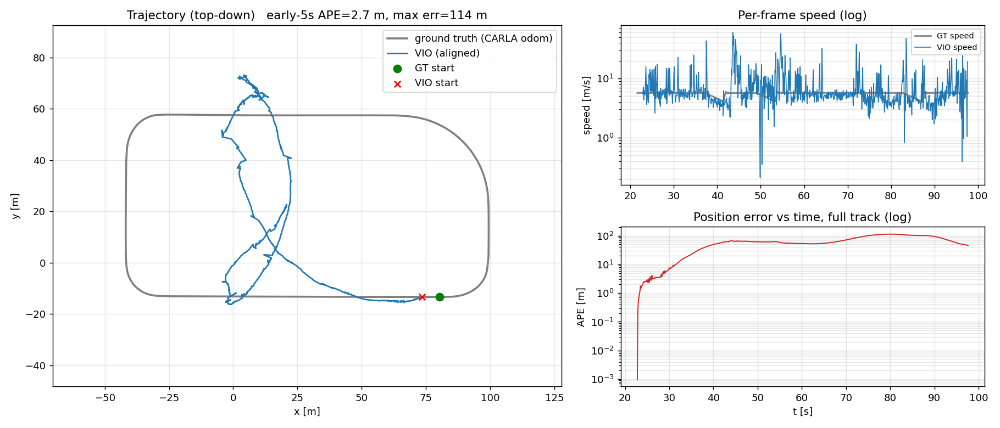 | 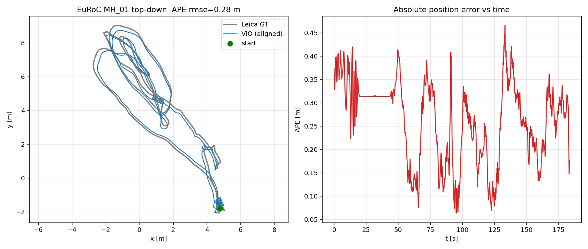 |

   The **varied motion** of `town10_alwaysrun` restores IMU observability (stereo+imu+gps → 0.3 m),
   confirming the cause is the *motion profile*, not the pipeline.
4. **Live reproduces offline.** After fixing the left/right camera swap and raising the rates
   (20 Hz cameras, 200 Hz IMU, 200 Hz world tick), live stereo and stereo+gps are **sub-metre and
   deterministic** in real time (0.6 m and 0.3 m). Both IMU variants diverge on **all 5** live runs —
   which rules out a control/timing artifact and points squarely at the degeneracy above.
5. The estimator itself is deterministic; non-determinism only appears in `global_fusion` when it is
   fed a marginal/diverged estimate. Real-time performance: **~3.3 ms/frame on CPU** (backlog 0) — and
   note the front end runs **CPU**, not GPU: the CUDA path measured *slower* (~5 ms) at this
   resolution/feature budget, so `use_gpu: 0` is the deliberate default.

   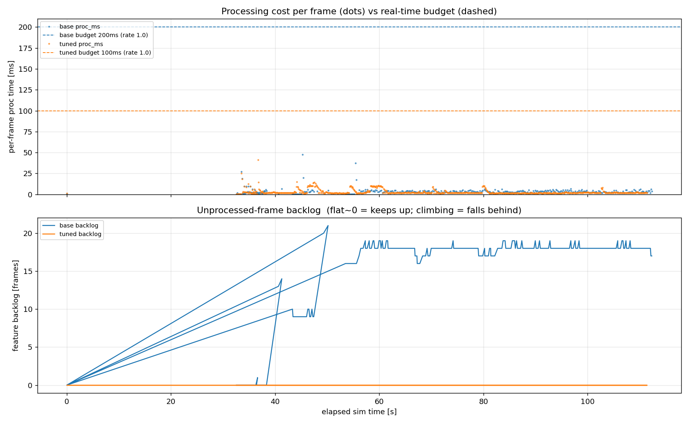

6. **Good position ≠ good heading for the GPS variants.** Now that offline logs orientation, the yaw
   table shows `global_fusion` delivers sub-metre *position* but **unreliable heading on the town10
   loop** (~77–94° yaw RMSE) — GPS constrains position, not heading, so in a loosely-coupled pose
   graph the global yaw is weakly observable. Pure stereo/VIO keep heading well where position holds
   (town01 ≤ 0.2°), and on town01 the GPS heading is also fine (0.6°); it is specifically the town10
   route that breaks the fused heading. **Takeaway:** if a downstream consumer needs heading (e.g. the
   MPC), prefer the raw VIO orientation over the GPS-fused one.

---

## 5. MPC (Model-Predictive Control)

> This section documents the method + equations as implemented in
> [`mpc.hpp`](src/carla_cpp/mpc.hpp); the **tuning experiment** (horizon & lookahead sweeps, with
> tracking + controller-behavior results) is in [§5.1](#51-experiment--horizon-and-lookahead-tuning) below.

A **sampling (brute-force) MPC**. Each control cycle it rolls a kinematic bicycle model forward over
the horizon for a small grid of candidate `(steer, accel)` pairs, scores each rollout, and applies the
lowest-cost one. No gradient solver — just enumerate, simulate, pick the best.

**1. Bicycle-model rollout** — per candidate, $H$ steps, $dt = 0.10\,\text{s}$, wheelbase
$L = 2.875\,\text{m}$, $\delta_{\max} = 0.60\,\text{rad}$. State is $(x, y, \psi, v)$ in ROS/ENU:

$$
v_{t+1} = \mathrm{clamp}(v_t + a\,dt,\; 0,\; v_{\max}), \qquad
x_{t+1} = x_t + v_{t+1}\cos\psi_t\,dt, \qquad
y_{t+1} = y_t + v_{t+1}\sin\psi_t\,dt
$$

$$
\psi_{t+1} = \psi_t + \frac{v_{t+1}}{L}\,\tan(\delta\,\delta_{\max})\,dt
$$

**2. Candidate set** — 7 steer × 6 accel = **42 rollouts** per cycle:

$$
\delta \in \delta_{\text{prev}} + \{-0.30,\, -0.18,\, -0.09,\, 0,\, 0.09,\, 0.18,\, 0.30\} \quad (|\delta| \le 0.65)
$$

$$
a \in \{\, -a_{\text{dec}},\; -\tfrac{1}{2}a_{\text{dec}},\; a_{\text{des}},\; 0,\; \tfrac{1}{2}a_{\text{acc}},\; a_{\text{acc}} \,\}, \qquad
a_{\text{des}} = \mathrm{clamp}\!\left( \frac{v_{\text{target}} - v}{H\,dt},\; -a_{\text{dec}},\; a_{\text{acc}} \right)
$$

with $a_{\text{acc}} = 2$, $a_{\text{dec}} = 4\ \text{m/s}^2$.

**3. Cost** — minimized over the 42 candidates (input regularizers + a lookahead-weighted sum over the
rollout + a heavy terminal pull):

$$
J = 0.12\,\delta^2 + 1.2\,(\delta - \delta_{\text{prev}})^2 + 0.04\left(\frac{a}{a_{\text{acc}} + a_{\text{dec}}}\right)^2 + \sum_{t=1}^{H} \left[ (1 + 0.08\,t)\,1.8\,d_t^2 + 1.2\,e_{\text{los},t}^2 + 0.25\,e_{\text{tgt},t}^2 + 0.45\,(v_t - v_{\text{target}})^2 \right] + 3.0\,d_H^2
$$

where $d_t$ = distance to the target point, $e_{\text{los},t} = \mathrm{atan2}(\Delta y, \Delta x) - \psi_t$
(line-of-sight heading error) and $e_{\text{tgt},t} = \theta_{\text{target}} - \psi_t$
(terminal-heading error). The $(1 + 0.08\,t)$ factor makes later steps count more (lookahead); the
$3.0\,d_H^2$ term strongly pulls the final pose onto the target.

In LQR/MPC terms the coefficients above are diagonal **input ($R$)**, **state ($Q$)** and **terminal
($Q_f$)** weights — there is no Riccati/QP solve (this is a sampling MPC, §below), so they act as
scalar tuning gains rather than solver matrices:

$$
R = \mathrm{diag}\big(\underbrace{0.12}_{\delta},\; \underbrace{1.2}_{\Delta\delta},\; \underbrace{0.04}_{\hat{a}}\big), \qquad
Q = \mathrm{diag}\big(\underbrace{1.8\,(1{+}0.08\,t)}_{d_t},\; \underbrace{1.2}_{e_{\text{los}}},\; \underbrace{0.25}_{e_{\text{tgt}}},\; \underbrace{0.45}_{v-v_{\text{target}}}\big), \qquad
Q_f = \underbrace{3.0}_{d_H}
$$

where $\hat{a} = a/(a_{\text{acc}}+a_{\text{dec}})$. The dominant $R$ term is the steer-**rate** weight
($1.2$, 10× the steer-magnitude weight) — the controller prizes smooth steering over small steering;
the dominant $Q$ term is position tracking ($1.8$, ramped by lookahead), reinforced by $Q_f = 3.0$ at
the horizon. All weights are hardcoded literals in
[`mpc.hpp`](src/carla_cpp/mpc.hpp) (`rolloutCost`) — tuning them means editing the source and rebuilding.

**4. Control mapping → CARLA** (the winning $\delta^{\ast}, a^{\ast}$; $\mathrm{smooth}(\cdot)$ = ENU→CARLA
sign flip, rate-limited $1.8/\text{s}$, $\alpha = 0.35$ low-pass). Here $v_c$ = cruise speed (config
`target_speed`), $d$ = distance to the target and $d_{\text{tol}} = 0.75\,\text{m}$ = goal tolerance:

$$
v_{\text{target}} = \min\!\left( v_c,\; \sqrt{2\,a_{\text{dec}}\,(d - d_{\text{tol}})} \right)
$$

When $a^{\ast} \ge 0$ the controller throttles, otherwise it brakes:

$$
\text{steer} = \mathrm{smooth}(-\delta^{\ast}), \qquad
\text{throttle} = \mathrm{clamp}(\, 0.10 + 0.20\,a^{\ast} + 0.04\,(v_{\text{target}} - v),\ 0,\ 0.45 \,), \qquad
\text{brake} = \mathrm{clamp}(\, -a^{\ast}/a_{\text{dec}},\ 0,\ 1 \,)
$$

The $v_{\text{target}}$ braking-distance cap makes the car slow smoothly into the goal; within `goal_tol` it
brakes to a stop. Defaults: `target_speed` 3.5 m/s (raise to ~5.5 to match autopilot-recorded GT),
horizon 100 steps = 10 s (tune `horizon ≈ lookahead / target_speed` so the rollout reaches the target
without overshooting).

**Driving the MPC on a VINS state (bootstrap + handover).** Because a VINS estimate is not available
at t = 0 (and lives in a different frame from the recorded path), the MPC first drives on
`/carla/ego_vehicle/noise_odometry` (ground truth + bounded noise, available immediately) for
`bootstrap_secs`, then **SE(2)-stitches** the selected VINS odom into that bootstrap frame and hands
over. Two helpers make a VINS estimate usable as the MPC state:

- **Frame registration** — the recorded path is in CARLA `map` coordinates; `/vins_stereo_gps` is in
  GPS-ENU (origin at the first GPS fix). `smooth_odom.py --map-offset 100,10` adds the spawn offset
  and relabels the frame so the registered estimate can be driven exactly like ground truth.
- **Velocity fill** — VINS odometry carries no twist, so the MPC's speed input would be 0 (→ constant
  max throttle). `smooth_odom.py` fills the twist from a smoothed position derivative.

Drive modes (`drive:=`): `coverage` (Traffic-Manager loop route, ignores lights — for map coverage),
`autopilot` (plain Traffic Manager), `trajectory` (MPC follows `/carla/ego_vehicle/trajectory_cmd`).

### 5.1 Experiment — horizon and lookahead tuning

**Setup.** The MPC drives the ego around the recorded **town10 loop** (442 m), following the reference
path published by `play_gt_path.py` while `mpc_debug_log.py` records GT pose, the control commands, and
speed at 20 Hz. Two one-axis sweeps (the two parameters are coupled — see the related-work note and
the rule below), each scored against the reference loop:
- **Horizon** $H \in \{1, 15, 50, 100\}$ steps at fixed lookahead $L_d = 6$ m.
- **Lookahead** $L_d \in \{1, 2, 6, 12\}$ m at fixed horizon $H = 15$.

Metrics: **completed** = drove the full lap (GT distance ≈ 442 m *and* ended < 10 m from the route
end); **x-track RMSE/max** = perpendicular deviation from the reference path; **steer std** = control
activity (chatter). Figures generated by [`generate_mpc_figs.py`](generate_mpc_figs.py).

**Horizon sweep** ($L_d = 6$ m) — *only* $H=15$ completes:

| $H$ | completed | GT dist | end→route-end | x-track RMSE | x-track max | mean speed | steer std |
|----:|:---------:|--------:|--------------:|-------------:|------------:|-----------:|----------:|
| 1 | ✗ | 125.6 m | 72.5 m | 0.93 m | 1.53 m | 3.42 m/s | **0.187** (chatter) |
| **15** | ✅ | **436.5 m** | **2.9 m** | 1.51 m | 3.87 m | 4.91 m/s | 0.082 |
| 50 | ✗ | 212.2 m | 114.7 m | 3.16 m | 7.12 m | 3.85 m/s | 0.069 |
| 100 | ✗ | 134.3 m | 84.5 m | 9.17 m | 11.97 m | **1.47** (crawl) | 0.135 |

**Lookahead sweep** ($H = 15$) — all complete; tracking is tightest at $L_d = 2$ m:

| $L_d$ | completed | GT dist | end→route-end | x-track RMSE | x-track max | mean speed |
|------:|:---------:|--------:|--------------:|-------------:|------------:|-----------:|
| 1 m | ✅ | 435.0 m | 0.8 m | 0.78 m | 1.96 m | 4.99 m/s |
| **2 m** | ✅ | 434.6 m | 0.6 m | **0.67 m** | 2.04 m | 5.05 m/s |
| 6 m | ✅ | 436.5 m | 2.9 m | 1.51 m | 3.87 m | 4.91 m/s |
| 12 m | ✅ | 435.3 m | 1.5 m | 1.01 m | 2.00 m | 5.15 m/s |

**Horizon sweep** — per-config trajectory (each config its own panel), then $x/y/\text{yaw}$ vs time,
then controller behavior:

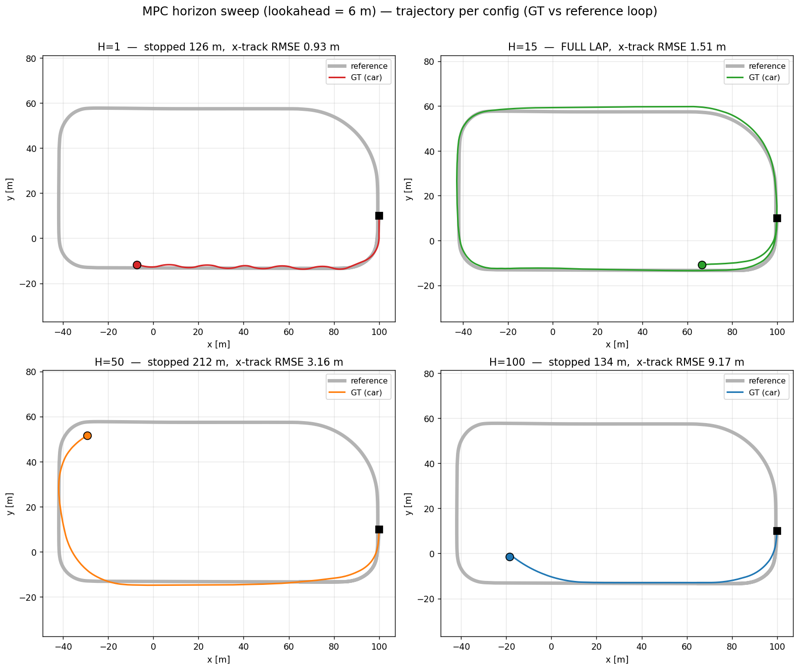

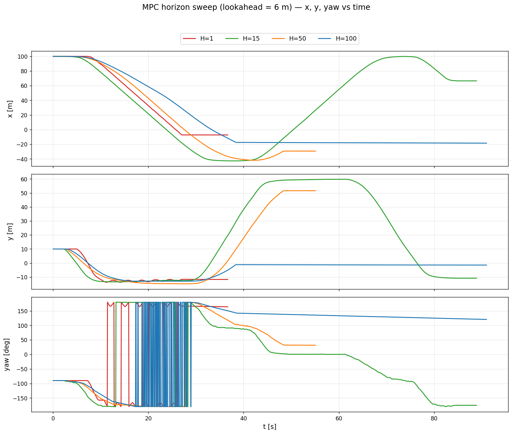

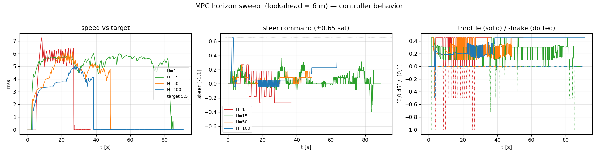

**Lookahead sweep** — same three views:

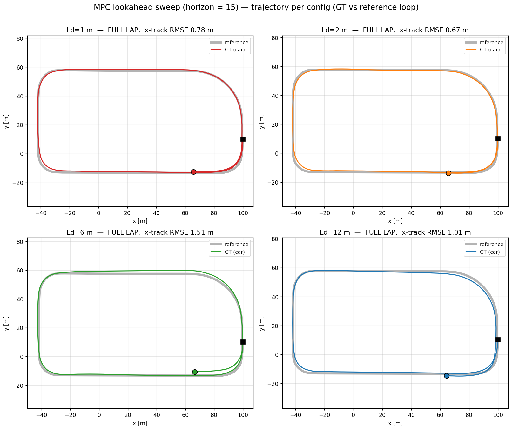

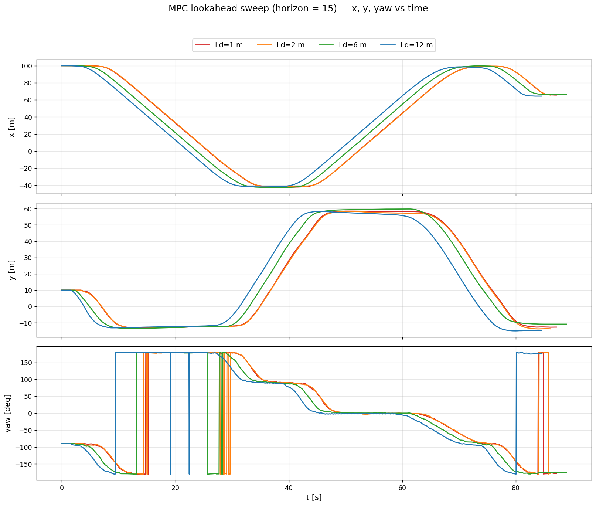

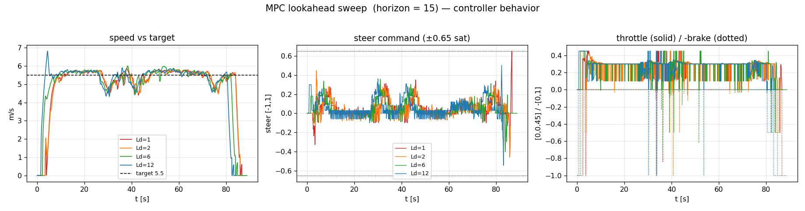

**Findings.**
1. **Horizon is the *completion* knob.** Only $H=15$ drives the full lap. $H=1$ is myopic and
   **chatters** (steer std 0.187, the visible ±0.5 oscillation in the behavior plot) → stalls early;
   $H=50/100$ overshoot the close target and **crawl/stall** ($H=100$ averages 1.47 m/s and covers only
   134 m in the same 91 s that $H=15$ uses to finish). This is the rollout-distance rule:
   $H\,dt\,v_c \gtrsim L_d$ ($H=15 \to 8.3$ m $\gtrsim 6$ m); too short can't reach the target, too long
   overshoots it.
2. **Lookahead is the *accuracy* knob.** With $H=15$ every lookahead completes, but tracking is
   **tightest at $L_d = 2$ m (0.67 m RMSE)** and degrades as $L_d$ grows by **corner-cutting**
   (6 m → 1.51 m, 12 m → 1.01 m). $L_d=1$ m starts to show slight steer saturation. On this low-speed
   (5.5 m/s), tight urban loop a *short* lookahead hugs the path better — which **revises the
   pure-pursuit time-headway guess of ~6 m**; the geometry rule sets the *upper* bound (corner-cut
   $\approx L_d^2/8R$), and the empirics land below it.
3. **Best config: $H = 15$, $L_d \approx 2$ m** — full lap, 0.67 m RMSE, smooth steering. $L_d = 6$ m
   also completes and is smoother through corners (a tracking-vs-smoothness trade), which is why the
   default run recipe uses 6 m.

### Configuration (parameters & defaults)

All MPC parameters are hardcoded defaults in [`mpc.hpp`](src/carla_cpp/mpc.hpp); only `horizon` and
`target_speed` are exposed as launch arguments (everything else needs a source edit + rebuild). The
cost weights ($Q$/$R$) are listed in the cost block above.

**Model & horizon**

| Parameter | Symbol | Default | Role | Set via |
|-----------|--------|---------|------|---------|
| `wheelbase_` | $L$ | 2.875 m | bicycle wheelbase (Tesla Model 3) | hardcoded |
| `dt_` | $dt$ | 0.10 s | rollout prediction step | hardcoded |
| `horizon_` | $H$ | 100 steps (10 s) | rollout length ($H\,dt$) | **`horizon:=`** |

**Speed & acceleration limits**

| Parameter | Symbol | Default | Role | Set via |
|-----------|--------|---------|------|---------|
| `target_speed_` | $v_c$ | 3.5 m/s | cruise speed | **`target_speed:=`** |
| `max_speed_` | $v_{\max}$ | 8.0 m/s | speed clamp | hardcoded |
| `max_accel_` | $a_{\text{acc}}$ | 2.0 m/s² | max acceleration | hardcoded |
| `max_decel_` | $a_{\text{dec}}$ | 4.0 m/s² | max deceleration (and braking-distance cap) | hardcoded |
| `goal_tol_` | $d_{\text{tol}}$ | 0.75 m | goal tolerance (brake to stop within) | hardcoded |
| `max_throttle_` | — | 0.45 | throttle command clamp | hardcoded |

**Steering**

| Parameter | Symbol | Default | Role | Set via |
|-----------|--------|---------|------|---------|
| `max_steer_angle_` | $\delta_{\max}$ | 0.60 rad | max physical steering angle | hardcoded |
| `max_norm_steer_` | — | 0.65 | max normalized steer command $\delta$ | hardcoded |
| `steering_sign_` | — | −1.0 | ENU→CARLA steer sign flip | hardcoded |
| `steer_rate_limit_` | — | 1.8 /s | steering slew-rate limit | hardcoded |
| `steer_filter_alpha_` | $\alpha$ | 0.35 | steering low-pass coefficient | hardcoded |
| `steer_smooth_w_` | — | 1.2 | steer-rate cost weight (the $R$ term on $\Delta\delta$) | hardcoded |

**Candidate set** — 7 steer × 6 accel = **42 rollouts/cycle**: steer offsets
$\{-0.30, -0.18, -0.09, 0, 0.09, 0.18, 0.30\}$ around the previous command, accel
$\{-a_{\text{dec}}, -\tfrac{1}{2}a_{\text{dec}}, a_{\text{des}}, 0, \tfrac{1}{2}a_{\text{acc}}, a_{\text{acc}}\}$.

> The node-level launch args that *drive* the MPC but are not in `mpc.hpp` — `mpc_state` (state
> source), `bootstrap_secs`, `noise_odom`, `drive` — are documented under the bootstrap/handover and
> drive-mode notes above.

### Related work: sampling-based MPC and the Dynamic Window Approach

Our controller belongs to the **sample-and-evaluate** family of local planners: discretize the control
space, integrate the vehicle model forward, score each candidate, apply the best — no QP/NLP solve.
Two classic references bracket where it sits.

- **Dynamic Window Approach** (Fox, Burgard & Thrun, 1997) — samples *velocities* $(v, \omega)$ for a
  synchro-drive robot, evaluates one short interval, and maximizes
  $G = \alpha\,\text{heading} + \beta\,\text{dist} + \gamma\,\text{vel}$. It is fundamentally a
  *reactive collision-avoidance* method; its admissible-velocity rule
  $v \le \sqrt{2\,\text{dist}\cdot \dot v_b}$ is the same $\sqrt{2 a d}$ braking-distance limit we use in
  [`targetSpeedForDistance`](src/carla_cpp/mpc.hpp#L74-L79) — except we brake for the **goal**, it brakes
  for the **nearest obstacle**.
- **Sampling-Based MPC / SBMPC** (Dunlap, Collins & Caldwell, 2008) — shares our exact philosophy
  ("sample the input space, integrate the nonlinear model, avoid the local minima of NLP"), our
  Ackermann/bicycle model, and our $Q$/$R$ tracking-cost form. But SBMPC wraps the sampling in an
  **A\* tree search over input *sequences*** that plans all the way to the goal around obstacles
  (resolution-complete); we instead do a **flat, single-shot enumeration** of constant-input rollouts
  each cycle.

So this MPC sits **between** the two: the enumerate-and-score loop of DWA, with the genuine multi-step
bicycle rollout and $Q$/$R$ reference tracking of SBMPC — but **without** SBMPC's A\* tree or either
method's obstacle avoidance (it follows a reference path assuming a clear lane). The natural extension,
if obstacle avoidance is ever needed, is exactly what both papers add: a **clearance term** in the cost
plus an **admissible / safe-stop prune** (DWA), or an **A\* sequence search** to plan around obstacles
(SBMPC).

---

## 6. Traffic-light detection

> Code in [`tf_detect_02/`](tf_detect_02/) (ROS package name: `tf_detect`). **Result:** the system can
> choose and localize the relevant CARLA traffic light from the map + VINS pose; camera-only
> red/yellow/green state classification is usable only in a limited range and remains the weak link.

The traffic-light node is a **map-guided, route-aware, two-stage perception gate** followed by a
conservative action layer:

1. **Route-aware geometric ROI.** Parse `Town10HD.xodr` plus `carla_light_boxes.csv`, select the
   signal reference that matches the current planned turn, and project the selected 3D lamp head into
   the camera image with the current odometry and camera model.
2. **Expanded ROI + YOLO confirmation.** The projected ROI is expanded before cropping so VINS
   localization error does not crop the light out. `yolo11s.pt` runs only on that crop (COCO class 9 =
   traffic light) and returns a tighter traffic-light box in full-image coordinates.
3. **Brightness-position state readout.** Inside the YOLO box, the node isolates bright **and**
   saturated pixels in the central x-band and sums their energy in vertical thirds. Top = red, middle =
   yellow, bottom = green. Hue is intentionally avoided because CARLA lamps render as similar amber
   glows.
4. **Safety gating and temporal filtering.** State is trusted only when the YOLO box is large enough
   and the light is close enough (`min_state_bbox_height_px`, `max_state_distance_m`). Red/yellow can
   be merged into a conservative `caution` token (`caution_stop:=true`) that publishes `red`/`stop`,
   unknown is held briefly, and stale lights are ignored once the ego has turned off or passed them.

**Topics.** Subscribes: `/carla/ego_vehicle/<cam>/image` plus `camera_info`,
`/vins_stereo_vel/odometry` (or `/carla/ego_vehicle/odometry` for GT tests), and
`/traffic_light/route_turn` when automatic route-turn bridging is enabled. Publishes:
`/traffic_light/state` (`red`/`green`/`yellow`/`unknown`/`none`), `/traffic_light/action`
(`stop`/`slow`/`go`), `/traffic_light/status` (JSON diagnostics), and `/traffic_light/debug_image`.

Run the node alone with `ros2 launch tf_detect traffic_light_state.launch.py`, or run the normal
integrated traffic-light stack with `ros2 launch tf_detect traffic_light_integrated.launch.py`
(`traffic_light_state_node.py` + `route_turn_from_path.py`). Analyse bags offline with
[`validate_projection.py`](tf_detect_02/scripts/validate_projection.py).

### 6.1 Frame registration and route selection

The ROI projection needs the ego pose in the **CARLA `map`** frame, but the live MPC state
`/vins_stereo_vel/odometry` is raw VINS `world` with origin/yaw fixed at VINS initialization.
[`register_vins_to_map.py`](tf_detect_02/scripts/register_vins_to_map.py) estimates a constant SE(2)
registration against CARLA odometry and the launch freezes it into:

| Launch arg | Value used in the final traffic-light launch | Meaning |
|------------|----------------------------------------------|---------|
| `odom_map_x_offset` | `99.5` | VINS-world to CARLA-map x translation |
| `odom_map_y_offset` | `12.076` | VINS-world to CARLA-map y translation |
| `odom_map_z_offset` | `-0.35` in `traffic_light_state.launch.py` (`-0.45` passthrough default in the integrated launch) | vertical alignment offset |
| `odom_map_yaw_offset_deg` | `-88.992` | VINS-world to CARLA-map yaw rotation |
| `camera_pitch_offset_deg`, `camera_yaw_offset_deg` | `-1.0`, `1.0` | pixel-level camera projection nudges |

The route-turn bridge
[`route_turn_from_path.py`](tf_detect_02/scripts/route_turn_from_path.py) derives
`/traffic_light/route_turn` from the MPC target heading (`/carla/ego_vehicle/trajectory_cmd`) and the
current VINS yaw:

$$
\Delta\psi = \mathrm{wrap}(\theta_{\text{target}} - \psi_{\text{ego}})
$$

With the default hysteresis, `|Delta psi| < 10 deg` releases back to `Straight`, while crossing
`18 deg` enters a turn:

| Condition | Published turn | Selected lamp-head index |
|-----------|----------------|--------------------------|
| $\Delta\psi > 18^\circ$ | `Left` | `1` |
| $\Delta\psi < -18^\circ$ | `Right` | `0` |
| otherwise | `Straight` | `2` |

The selected OpenDRIVE signal is also filtered by distance (`trigger_distance:=60` m), angle to the
vehicle forward direction (`max_reference_angle_deg:=110`), and signal heading
(`path_physical_signal_mode:=same-heading`, tolerance `75` deg), so the node does not blindly use every
traffic light visible at an intersection.

### 6.2 Map-to-camera ROI projection

For a selected traffic-light head center $P_{\text{map}}$, the projection is:

$$
P_{\text{ego}} = R_{\text{map}\to\text{ego}}^\top (P_{\text{map}} - t_{\text{map}\to\text{ego}})
$$

$$
P_{\text{cam}} = R_{\text{ego}\to\text{cam}}^\top (P_{\text{ego}} - t_{\text{ego}\to\text{cam}})
$$

The CARLA camera axes are remapped into the pinhole optical convention used by the code:

$$
x_{\text{opt}} = Y_{\text{cam}}, \qquad y_{\text{opt}} = -Z_{\text{cam}}, \qquad
z_{\text{opt}} = X_{\text{cam}}
$$

and the final image projection is:

$$
u = f_x \frac{x_{\text{opt}}}{z_{\text{opt}}} + c_x, \qquad
v = f_y \frac{y_{\text{opt}}}{z_{\text{opt}}} + c_y
$$

`image_horizontal_sign:=flip` negates $x_{\text{opt}}$; without that flip the map-projected traffic
light lands mirrored in the image. The projected lamp-head box size is depth-scaled from the CARLA
box extents and clamped:

$$
w = \mathrm{clamp}\left(f_x\,\frac{W_{\text{physical}}}{z_{\text{opt}}}\,1.35,\;16,\;100\right),
\qquad
h = \mathrm{clamp}\left(f_y\,\frac{H_{\text{physical}}}{z_{\text{opt}}}\,1.35,\;24,\;140\right)
$$

The ROI sent to YOLO is larger than this projected box:

$$
w_{\text{crop}} = \max(w\cdot\texttt{yolo\_roi\_scale},\;\texttt{yolo\_min\_roi\_width}),\qquad
h_{\text{crop}} = \max(h\cdot\texttt{yolo\_roi\_scale},\;\texttt{yolo\_min\_roi\_height})
$$

The final launch uses `yolo_roi_scale:=5.0`, `yolo_min_roi_width:=160`, and
`yolo_min_roi_height:=180`; the node default is smaller (`3.5`, `100`, `120`) for debugging.

### 6.3 YOLO confirmation and state/action policy

YOLO is **not** the state classifier. It runs inside the expanded crop and the node chooses the
detection closest to the projected ROI center, with a confidence tie-break:

$$
\text{score} = \frac{\lVert c_{\text{yolo}} - c_{\text{proj}} \rVert}{\text{roi diagonal}}
- 0.20\,\text{confidence}
$$

The chosen YOLO box is then passed to the brightness-position classifier:

1. crop the central x-band (`state_x_band_lo:=0.3`, `state_x_band_hi:=0.7`);
2. convert BGR to HSV and use `V` as brightness plus `S` as a saturation gate;
3. compute a local floor and threshold:

   $$
   \text{floor}=P_{40}(V),\qquad \text{strength}=\max(V)-\text{floor},\qquad
   \text{threshold}=\text{floor}+0.72\,\text{strength}
   $$

4. keep lit pixels where `V >= threshold` and `S >= state_sat_min`;
5. sum lit energy in vertical thirds:

   $$
   E = \max(V-\text{floor},0)\cdot\text{mask}
   $$

   top-third energy = red score, middle-third = yellow score, bottom-third = green score.

If the winning score is not at least `state_score_ratio:=1.15` times the second score, the raw state is
`unknown` (`low_contrast`). The node also gates state confidence with:

| Gate | Default in launch | Effect |
|------|-------------------|--------|
| `min_state_bbox_height_px` | `13.5` px | smaller YOLO boxes cannot be read reliably |
| `max_state_distance_m` | `40.0` m | beyond this range the state is forced to `unknown` |
| `state_confirm_frames` | `3` | token must persist before the smoothed state changes |
| `unknown_hold_seconds` | `0.9` s | short unknown gaps hold the last confirmed token |
| `caution_stop` | `true` | red/yellow collapse to `caution` and publish `stop` |

Action mapping after smoothing:

| State token | Published state | Action |
|-------------|-----------------|--------|
| `green` | `green` | `go` |
| `yellow` | `yellow` | `slow` |
| `red` | `red` | `stop` |
| `caution` | `red` | `stop` |
| `unknown` | `unknown` | `slow` |
| `none` | `none` | `go` |

`tf_detect_02` also adds stateless "stop obeying this light" checks so a turn light is ignored after
the car has committed through the junction:

| Ignore reason | Condition |
|---------------|-----------|
| `turned_off_lane` | heading error from the signal heading exceeds `ignore_turn_heading_deg:=40` |
| `near_light` | distance to the light head is less than `ignore_near_distance_m:=5` in launch |
| `passed_light` | abeam angle from ego forward to light head exceeds `ignore_abeam_angle_deg:=85` |

The diagnostic JSON on `/traffic_light/status` includes `signal_id`, `roi_signal_id`, `turn_relation`,
`distance_m`, `proj_box`, `yolo_box`, `bbox_height_px`, `raw_state`, smoothed `state`, `action`,
`ignore_reason`, and `diag` (`y_norm`, `rg`, `lit_rgb`, `lit_px`, `zone_energy`, ...).

### 6.4 Results and analysis

**Exp. A — VINS odometry effect on projection, no YOLO reference.** The same selected traffic-light
box is projected with CARLA GT odometry and with VINS odometry. The metric is the pixel shift between
the two projected ROI centers:

$$
e_{\text{center}} =
\sqrt{(u_{\text{vins}}-u_{\text{gt}})^2 + (v_{\text{vins}}-v_{\text{gt}})^2}
$$

and IoU is computed directly between the two projected boxes (not against YOLO).

| Metric | Value |
|--------|------:|
| evaluated frames | 870 |
| mean center shift | 9.65 px |
| median center shift | 6.41 px |
| RMS center shift | 11.78 px |
| P90 center shift | 20.55 px |
| mean normalized shift (`center_shift / h_gt`) | 0.320 |
| mean projection IoU | 0.428 |
| mean vertical IoU | 0.660 |

This is why the live node expands the projected ROI before YOLO: the VINS projection is close enough to
guide the crop, but not reliable enough to use as a tight box.

**Exp. B — state readout.** The useful state-estimation range in the collected bag is about
**20-40 m**:

| Distance to light | State accuracy | Unknown rate | Mean YOLO box height |
|-------------------|---------------:|-------------:|---------------------:|
| 0-20 m | 15.8% | 52.6% | 36.1 px |
| 20-30 m | 80.5% | 13.7% | 22.7 px |
| 30-40 m | 88.1% | 10.0% | 18.6 px |
| 40-60 m | 0.0% | 100.0% | 14.0 px |
| 60-100 m | 0.0% | 100.0% | 8.8 px |

The classifier is intentionally conservative beyond 40 m (`too_far`) and with small boxes
(`bbox_too_small`). Within the usable band the raw-state confusion still shows the data limitation:

| Ground truth | Correct | Unknown | Main failure |
|--------------|--------:|--------:|--------------|
| red | 61.7% | 36.4% | red often becomes `unknown` |
| green | 70.2% | 19.0% | green sometimes becomes yellow/unknown |

The root cause is that YOLOv11 (trained as a COCO traffic-light *presence* detector) does not
consistently frame the full 3-lamp housing. Quantitatively:

| Evidence | Value | Interpretation |
|----------|------:|----------------|
| YOLO height / projected height | 0.607 mean | YOLO often frames less than the full housing |
| full box IoU (`proj_box` vs `yolo_box`) | 0.153 mean | map housing box and YOLO visual box overlap weakly |
| vertical IoU | 0.428 mean | vertical position in the YOLO box is not stable |
| GT-red lit centroid `y_norm` | 0.342 mean | should be near 0.17 for a top lamp |
| GT-green lit centroid `y_norm` | 0.614 mean | should be near 0.83 for a bottom lamp |
| bbox height at 30-40 m | 18.6 px mean | each of 3 vertical zones is only about 6 px |
| bbox height at 60-100 m | 8.8 px mean | too small to resolve three lamps |

Colour is also not a robust fallback. The diagnostic `rg=(R-G)/(R+G+1)` gives mean `0.074` for GT-red
and `0.006` for GT-green in the bag; red/yellow/green are rendered with a similar amber glow, so hue
thresholding alone cannot solve the problem. The failure is therefore **data-limited, not just
threshold-limited**.

Practical conclusion: keep the reusable parts (map-guided ROI, route-turn signal selection, YOLO
presence confirmation, temporal/action gating), but treat camera-only colour/state as a limited
prototype. A production version should either train a dedicated CARLA traffic-light-state classifier,
use higher-resolution/closer crops, or project known per-lamp geometry and sample brightness at each
lamp head directly.

---

## 7. Integration

The full closed loop run end-to-end on the town10 loop: **stereo VINS → MPC follows the recorded path
→ traffic-light gate brakes the car at red lights**. The MPC drove on the **stereo** VINS state
(GPS-registered into the `map` frame, `/vins_stereo_gps`), at horizon 15, with the traffic-light action
gating throttle/brake; logged with `mpc_debug_log.py` to `logs/finalresult.csv` (186 s).

**Result** — the car completed the lap *and* stopped at the lights:

| Metric | Value |
|--------|-------|
| Lap distance (GT) | **439 m** (full loop) — ended 1.4 m from the route end |
| Path-following x-track | **0.81 m RMSE**, 2.06 m max |
| Cruise speed | ~5.5 m/s between lights |
| Traffic-light stops | **2** brake-to-hold events (brake ≈ 0.95, speed → 0): at the spawn junction (~29 s) and a mid-loop junction at (−27, −12) (~41 s) |

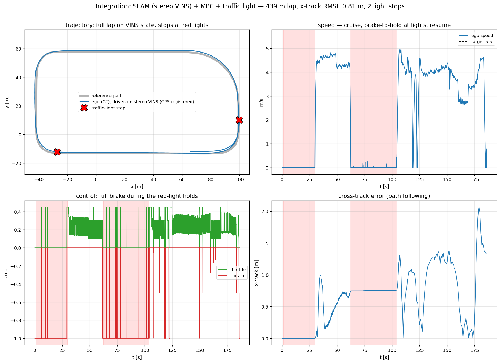

The figure shows all three layers working together: the ego (driven on the stereo VINS estimate) tracks
the reference loop to sub-metre accuracy (top-left, bottom-right), while the speed and control traces
(top-right, bottom-left) show it cruising at ~5.5 m/s, **braking fully to a hold at each red light**
(shaded), then resuming — i.e. the SLAM→MPC→traffic-light loop closes.

**Caveats (honest scope).**
- `mpc_debug_log.py` does **not** record the traffic-light state/action, so the two stops are
  identified from their *signature* (full brake + speed→0 mid-route), which is exactly what the gate's
  `stop` action produces — but the log can't independently prove the trigger was the light.
- Per §6.2, the **camera-only light state is unreliable**, so a dependable gate uses the **ground-truth
  light state** (`/carla/traffic_lights/gt_status`); this run demonstrates the *control* integration,
  not camera-based perception of the light.
- The MPC's *control* topic is the GPS-registered stereo odom (`/vins_stereo_gps`); raw `/vins_stereo`
  is in the VINS-local frame (≈205 m from `map`) and cannot follow the map-frame path without that
  registration.

### 7.1 3D map reconstruction — VINS vs GT

The other half of integration is the **map**: RTAB-Map built two 3D point clouds of the town10 loop —
one on the **stereo VINS** odom (the run above, `3D_map/finalresult.ply`) and one on **GT** odom (a
`drive:=coverage` sweep with `rtab_odom:=/gt_world_body/odometry`, `3D_map/gt_map.ply`). They are
compared cloud-to-cloud with [`eval_map.py`](eval_map.py): **FPFH+RANSAC global registration → ICP**
(to remove the VINS-world↔map frame offset), then nearest-point distances.

| Metric (VINS map → GT map) | Value |
|----------------------------|------:|
| Mean point distance | **0.40 m** |
| RMSE | **0.73 m** |
| Hausdorff (p95) | 1.35 m |
| Accuracy @0.5 m | **80.9 %** |
| Completeness @0.5 m | **85.0 %** |
| **F-score @0.5 m** | **82.9 %** |
| ICP alignment fitness | 0.975 (inlier RMSE 0.46 m) |

**What each metric means.** The raw ingredient is: for every point in one cloud, the distance to the
*nearest* point in the other. Measuring **VINS→GT** asks "is what I built correct?"; **GT→VINS** asks
"did I capture everything?".

| Metric | In plain words | How it's computed | Better |
|--------|----------------|-------------------|:------:|
| Mean distance | average gap between the VINS map and the real surface | mean of VINS→GT nearest distances | lower |
| RMSE | same, but punishes big errors more (squares them) | root-mean-square of those distances | lower |
| Hausdorff (p95) | worst-case error, ignoring the worst 5% outliers | 95th percentile of VINS→GT distances | lower |
| Accuracy @0.5 m | of what the SLAM *drew*, how much is near real geometry (**precision**) | % of VINS points with a GT point within 0.5 m | higher |
| Completeness @0.5 m | of the *real world*, how much the SLAM captured (**recall**) | % of GT points with a VINS point within 0.5 m | higher |
| **F-score @0.5 m** | single balanced score of the two above (**headline**) | harmonic mean of accuracy & completeness | higher |
| Voxel IoU @0.3 m | overlap of occupied 30 cm boxes (very strict — see caveat 2) | shared boxes ÷ total boxes | higher |
| ICP fitness | how trustworthy the *alignment* was (a sanity check, not map quality) | % of points that found a match when aligning | higher |

Reading it: distances (mean/RMSE/Hausdorff) are in metres — **lower is better**; the percentages
(accuracy/completeness/F-score) are **higher is better**. The **0.5 m** is the "how close is close
enough" tolerance — tighten it and the percentages drop. **Accuracy vs completeness = precision vs
recall**: accuracy punishes wrong/extra points, completeness punishes missing coverage, and F-score
balances them. The **mean (0.40) vs RMSE (0.73) gap** says most points are very close but a *tail* of
larger errors exists (the red regions at the loop ends below). ICP fitness comes first: at 0.975 the
maps were lined up well, so the rest of the numbers are real.

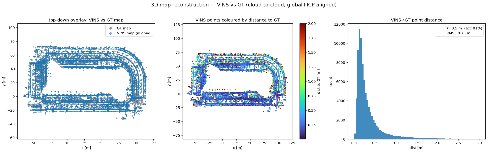

**Analysis.** After registration the VINS-built map reconstructs the GT-built map to **sub-metre**
(0.40 m mean, 0.73 m RMSE, **83 % F-score @0.5 m**) — i.e. the map the SLAM stack produces live is
metrically faithful to the ground-truth map, not just the trajectory. The overlay (left) shows the two
loops coincide; the per-point heatmap (middle) is mostly < 0.5 m, with the larger errors at the loop
extremities where stereo-VO drift accumulates before returning.

**Caveats (in plain terms):**

1. **We line the two maps up before measuring.** The VINS map is drawn in its own coordinate system —
   shifted and rotated from the GT map — so we first slide and rotate it to sit on top of GT, then
   measure how well they match. This means the numbers answer *"is the **shape** of the map right?"*,
   not *"is it pinned to the exactly-right spot?"* (pinning it to the world is the GPS/registration job
   from earlier). The simple "match the centres" line-up wasn't enough to undo the rotation (it only
   got 25% of points to agree); a smarter feature-based line-up (FPFH+RANSAC) fixed that (98% agree).
2. **Ignore the "Voxel IoU = 1.9%" number** — it looks alarming but isn't meaningful here. It chops
   space into 30 cm boxes and only counts a point as "matching" if it lands in the *exact same box* as
   GT, so even a tiny, harmless offset makes it look terrible. The **F-score** (how much of the map is
   within half a metre of GT) is the number that actually reflects quality.
3. **The GT map is the fair yardstick.** It was built by the **same cameras**, just given a perfect
   position feed — so it's literally "the best map this sensor rig could make." Comparing the VINS map
   against it tells us how much the SLAM stack's *own* position errors hurt the map.

---

## 8. Conclusion & discussion

- **SLAM is validated.** GPS-fused variants are sub-metre and deterministic offline; **live reproduces
  offline** in real time once the camera swap and sensor rates were fixed.
- **The IMU-on-smooth-motion failure is a genuine observability degeneracy**, not a bug — it persists
  across online/offline/live and is cured by varied motion, and matches VINS-Fusion behaviour on
  EuRoC/KITTI. The practical recommendation is **stereo+GPS** for normal CARLA driving.
- **MPC is implemented, runs live, and is tuned** (§5.1): on the town10 loop it follows the recorded
  path at **0.67 m cross-track RMSE** (horizon 15, lookahead 2 m). Horizon sets lap *completion*
  (only $H=15$ finishes — short = myopic/chatter, long = overshoot/crawl); lookahead sets tracking
  *accuracy* (shorter hugs the path, less corner-cutting).
- **Traffic-light *localization* works, but camera-only *state* classification does not.** Geometric ROI
  selection + YOLO presence confirmation reliably find the light, but reading red/yellow/green from the
  pixels fails — a **data limitation, not a tuning one** (§6.2): YOLO's box does not consistently frame
  the 3-lamp housing (lit-lamp `y_norm ≈ 0.45` even for a ground-truth **red** light), the head is only
  ~17–45 px tall at approach range, and all lamps render a similar amber (`lit_rgb ≈ [250,225,100]`) so
  hue cannot separate red from yellow. Reliable state would need a CARLA-trained state classifier,
  higher-resolution capture, or geometric per-lamp sampling (§6.2).
- **The full loop closes end-to-end** (§7): driven on the stereo VINS state, the MPC completes the
  439 m town10 lap at **0.81 m cross-track RMSE** and **brakes to a hold at the red lights** — SLAM,
  control, and the traffic-light gate working together.

**Next steps:** (1) for traffic lights, either train a dedicated CARLA state classifier or fall back to
geometric per-lamp sampling, then report precision/recall and state-transition latency, and feed *that*
(not GT) state into the gate; (2) log the traffic-light state/action alongside the integration run so
stop events are confirmed from the signal, not inferred.

---

## 9. Commands

> Verified against [`launch/carla_native_multi.launch.py`](launch/carla_native_multi.launch.py) and
> the repo-root scripts. Source `src/Athit VSLAM` is the original cheat-sheet; one path was corrected
> here (`carla_stereo_config.yaml` → `carla_stereo.yaml`).

### Build

```bash
cd ~/ros2_ws
source /opt/ros/humble/setup.bash
export LD_LIBRARY_PATH=/home/fibo3/local/lib:$LD_LIBRARY_PATH
colcon build --packages-select vins_fusion_ros2 global_fusion --cmake-args -DCMAKE_BUILD_TYPE=Release
source install/setup.bash
```

### Method 1 — online (rosbag playback)

Run each estimator in its own terminal, then play a bag:

```bash
# A: stereo
ros2 run vins_fusion_ros2 vins_fusion_ros2_node --ros-args -r __node:=vins_stereo \
  -p use_sim_time:=true -p config_file:=$PWD/src/config/carla/carla_stereo.yaml \
  -r odometry:=/vins_stereo/odometry -p output_path:=$PWD/output_rosbag/stereo2

# B: stereo+imu
ros2 run vins_fusion_ros2 vins_fusion_ros2_node --ros-args -r __node:=vins_stereo_imu \
  -p use_sim_time:=true -p config_file:=$PWD/src/config/carla/carla_stereo_imu.yaml \
  -r odometry:=/vins_stereo_imu/odometry -p output_path:=$PWD/output_rosbag/stereo_imu2

# C: stereo+gps (global_fusion)
ros2 run global_fusion global_fusion_node --ros-args -r __node:=gfus_stereo \
  -p use_sim_time:=true \
  -r /vins_estimator/odometry:=/vins_stereo/odometry -r /gps:=/carla/ego_vehicle/gnss \
  -r global_odometry:=/vins_stereo_gps/odometry \
  -p output_csv:=$PWD/output_rosbag/stereo_gps2/vio.csv

# D: stereo+imu+gps (global_fusion)
ros2 run global_fusion global_fusion_node --ros-args -r __node:=gfus_stereo_imu \
  -p use_sim_time:=true \
  -r /vins_estimator/odometry:=/vins_stereo_imu/odometry -r /gps:=/carla/ego_vehicle/gnss \
  -r global_odometry:=/vins_stereo_imu_gps/odometry \
  -p output_csv:=$PWD/output_rosbag/stereo_imu_gps2/vio.csv

# F: play the bag
ros2 bag play rosbag2_2026_06_07-11_29_12_town01_drivenormal --clock -r 1.0
```

### Method 2 — offline (direct read, fast & deterministic)

```bash
BR=install/vins_fusion_ros2/lib/vins_fusion_ros2/vins_bag_reader
BAG=rosbag2_2026_06_07-11_29_12_town01_drivenormal

# stereo (no extra args) / stereo+gps (append: gps /carla/ego_vehicle/gnss)
$BR src/config/carla/carla_stereo.yaml     $BAG ./output_direct/out_stereo1.csv
$BR src/config/carla/carla_stereo.yaml     $BAG ./output_direct/out_stereogps1.csv    gps /carla/ego_vehicle/gnss
$BR src/config/carla/carla_stereo_imu.yaml $BAG ./output_direct/out_stereoimu1.csv
$BR src/config/carla/carla_stereo_imu.yaml $BAG ./output_direct/out_stereoimugps1.csv gps /carla/ego_vehicle/gnss
```

### Method 3 — live (native CARLA C++)

```bash
# A: start CARLA
/home/fibo3/carla-package/CarlaUE4.sh -RenderOffScreen -quality-level=Low

# B: drive. coverage (map sweep):
ros2 launch vins_fusion_ros2 carla_native_multi.launch.py \
  town:=Town10HD spawn:=100.0,-10.0,1.0,0.0,0.0,90.0 drive:=coverage variants:=stereo_gps

#    trajectory (MPC) on stereo VINS:
ros2 launch vins_fusion_ros2 carla_native_multi.launch.py \
  town:=Town10HD spawn:=100.0,-10.0,1.0,0.0,0.0,90.0 drive:=trajectory \
  mpc_state:=/vins_stereo_vel/odometry bootstrap_secs:=8.0 target_speed:=5.5 horizon:=15 variants:=stereo traffic_light:=true

#    trajectory (MPC) on stereo+gps:
ros2 launch vins_fusion_ros2 carla_native_multi.launch.py \
  town:=Town10HD spawn:=100.0,-10.0,1.0,0.0,0.0,90.0 drive:=trajectory \
  mpc_state:=/vins_stereo_gps_map/odometry bootstrap_secs:=8.0 target_speed:=5.5 horizon:=15 variants:=stereo_gps traffic_light:=true

# C: live plot
python3 plot_result_rtab_cpp.py

# D: publish the reference path. GT state:
python3 play_gt_path.py --npz gt/rtab_log_gt_town10.npz --state /carla/ego_vehicle/odometry --lookahead 20.0
#    VINS/registered state (map frame, no anchor needed):
python3 play_gt_path.py --npz gt/rtab_log_gt_town10.npz \
  --state /carla/ego_vehicle/noise_odometry --position-mode --lookahead 6.0

# E: log every odom variant
python3 mpc_debug_log.py --out run5

# F: register + velocity-fill the VINS odom used as mpc_state
python3 smooth_odom.py --in /vins_stereo/odometry --out /vins_stereo_vel/odometry --max-track-speed 1000   # stereo
python3 smooth_odom.py --map-offset 100,10 --out /vins_stereo_gps_map/odometry                              # stereo+gps
```

### RTAB-Map 3D map

```bash
# build the live map (use_rtab is on by default; add rtab_viz:=true for the live GUI)
ros2 launch vins_fusion_ros2 carla_native_multi.launch.py ... rtab_viz:=true

# view the saved map (open the db the run actually wrote to — default below)
source /opt/ros/humble/setup.bash
rtabmap-databaseViewer ~/rtab_carla_live.db          # Edit → View 3D Map…
```

### Traffic-light detection

```bash
# stand-alone state node (manual/externally supplied route_turn)
ros2 launch tf_detect traffic_light_state.launch.py

# normal integrated traffic-light stack: state node + route-turn bridge from MPC target
ros2 launch tf_detect traffic_light_integrated.launch.py

# offline projection/YOLO/state validation over a recorded bag:
python3 src/tf_detect_02/scripts/validate_projection.py \
  --bag <rosbag>.db3 \
  --map src/Town10HD.xodr \
  --objects src/tf_detect_02/scripts/objects.json \
  --traffic-light-boxes src/carla_light_boxes.csv \
  --camera-id cam_front_right \
  --candidate-mode path \
  --path-physical-signal-mode same-heading \
  --image-horizontal-sign flip
```
